# Project Spec — Reorganized by Importance

> **Last updated:** 2026-04-07 UTC  
> **Updated by:** copilot agent  
> **Structure:** General Info → Criticalities & Issues → Latest Updates & History

---

# PART 1: GENERAL INFORMATION

## 1. Project Overview

This is a Screeps AI bot written in JavaScript. Screeps is a programming game where players write code to control units in a persistent MMO world. This bot implements automated colony management with dual-mode operation (planning and executing), role-based creep workforce management, and infrastructure automation for energy distribution, compound production, and market trading. The bot handles RCL 1-8 progression with adaptive strategies that shift from generalist swarm tactics to specialized roles as the colony matures.

---

## 2. Key Logic & Main Loop

### Main Loop ([main.js](main.js#L69-L200))

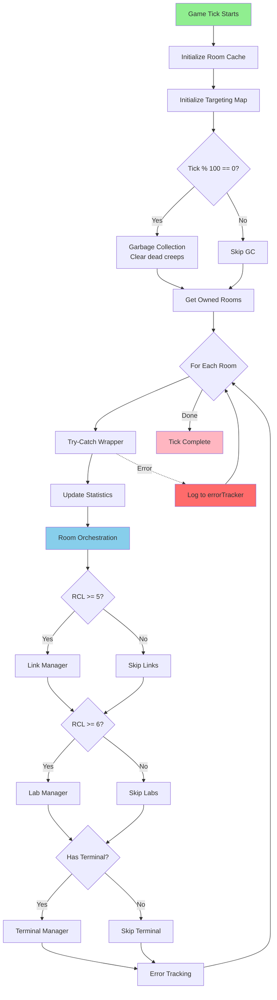

**Execution Flow:**
1. **Performance Optimization** — Initialize room cache and targeting map
2. **Garbage collection** — Clear memory for dead creeps and stale rooms (throttled to every 100 ticks)
3. **Per-room processing** — Filter owned rooms, iterate each with try-catch wrapper
4. **Statistics updates** — System stats, creep stats, energy collection metrics
5. **Room orchestration** — Priority mode management, spawn coordination, creep execution
6. **Infrastructure managers** — Links (RCL 5+), Labs (RCL 6+), Terminal (RCL 6+) with error tracking and caching
7. **Error boundary** — Try-catch wraps room processing; errors logged via errorTracker

### Room Cache System ([main.js](main.js#L91-L141))
**Purpose:** Eliminate redundant room.find() calls by caching per room per tick

**Cached Data:**
- Raw data: all structures, all creeps, construction sites, sources, dropped resources
- Derived caches: towers, spawns, extensions, containers, links, labs, storage, terminal, sources active
- Cache lifetime: 1 tick (cleared automatically at `Game.time` change)
- Access: `global.roomCache[roomName].structures`, `global.roomCache[roomName].towers`, etc.

**Impact:** Reduces room.find() calls from 200+ per tick to 5-8 per tick in busy rooms

### Global Targeting Map ([main.js](main.js#L143-L158))
**Purpose:** O(1) target contention lookups for efficient target selection

**Mechanism:**
- Build once per tick: iterate all creeps, map `global.targetingCounts[targetId] = count`
- Used by: `countCreepsTargeting()` in creep.targetFinding.js
- Enables instant lookup instead of nested iteration

**Impact:** O(1) lookup complexity for target contention checking

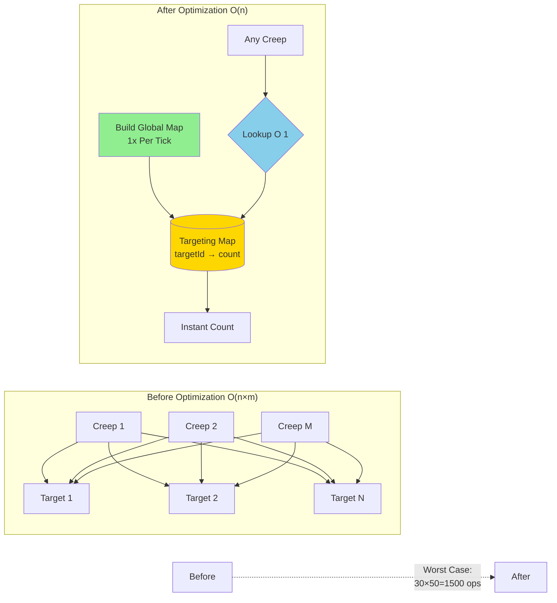

### Room Orchestration Workflow ([roomOrchestrator.js](roomOrchestrator.js))
1. **Priority Mode Check** — Activate/deactivate energy priority mode based on `timeToFillCapacity`
2. **Threat Assessment** — Analyze invasion threat via spawnerCombat.analyzeInvasionThreat()
3. **Roster Calculation** — Calculate desired creep counts per role with RCL scaling (via spawnerRoster)
4. **Spawn Execution** — Attempt to spawn highest priority role (via spawner)
5. **Tower Control** — Defensive firing, emergency repairs (optimized: single scan before loop)
6. **Creep Routing** — Execute all creeps' assigned actions (via baseCreep)
7. **Visual Display** — Room info, efficiency metrics

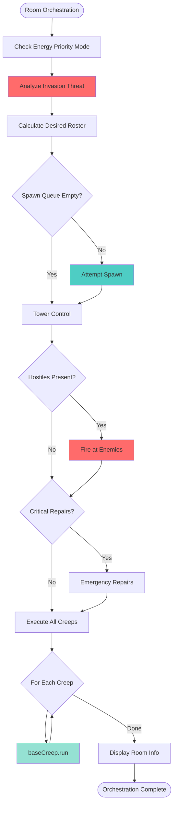

### Spawn Prioritization ([spawner.js](spawner.js))

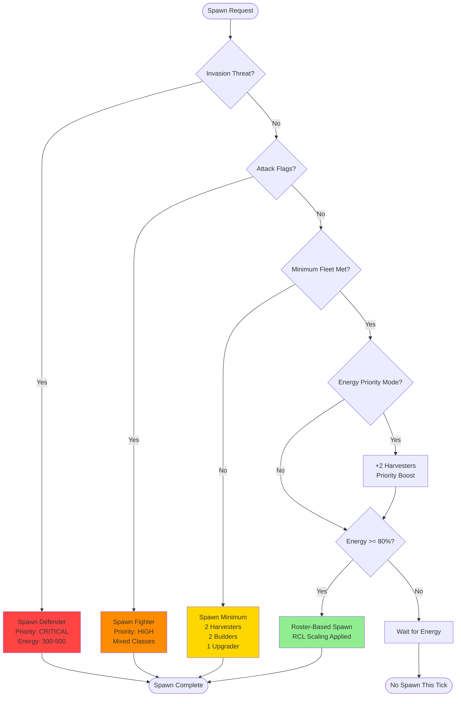

**Priority Order:**
1. **Defenders** (if invasion threat detected) — Reserved energy (300-500), immediate spawn
2. **Fighters** (if attack flags present) — Reserved energy, immediate spawn
3. **Minimum fleet** — 2 harvesters, 2 builders, 1 upgrader (bootstrapping)
4. **Priority mode boost** — +2 harvesters if `energyPriorityMode` active
5. **Roster spawning** — Only if energy ≥ 80% capacity; uses roster from spawnerRoster
6. **Fighter composition** — If fighters needed, spawn mixed classes based on RCL ratios

**Body Composition ([spawnerBodyUtils.js](spawnerBodyUtils.js)):**
- Adaptive sizing based on efficiency metrics (bootstrapping/developing/established/optimized)
- RCL multipliers scale creep size (1x at RCL 1-3, up to 2.5x at RCL 8)
- Pure functions for deterministic body calculation
- Role-specific templates (workers, haulers, miners, fighters, specialists)
- **Fighter bodies:** 4 specialized functions for fodder/invader/healer/shooter

### Creep Behavior ([baseCreep.js](baseCreep.js) + creep.* modules)

**Architecture:** Functional composition with clear module boundaries
- **baseCreep.js** — Orchestrates action selection and execution
- **creep.actionDecisions.js** — Selects next action based on priority list and state
- **creep.actionHandlers.js** — Executes action-specific logic (gathering, building, rally, attacking, etc.)
- **creep.targetFinding.js** — Finds and scores potential targets (uses global targeting map)
- **creep.analysis.js** — Analyzes creep capabilities and state
- **creep.effects.js** — Handles movement and memory updates
- **creep.constants.js** — Defines action requirements and visuals

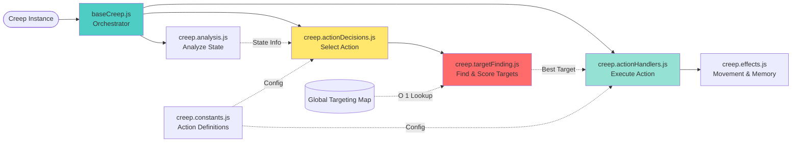

**Action Selection Flow:**
1. **Rally check** — If rally flag active → `rally` action takes priority
2. **Combat check** — If fighter with targets → `attacking`
3. **State transition check** — Empty → gather mode; Full → work mode
4. **Priority list iteration** — Choose first available action from role's priority list
5. **Target assignment** — Find and reserve target with contention checking (O(1) with targeting map)
6. **Action execution** — Delegate to appropriate handler in ACTION_HANDLERS registry

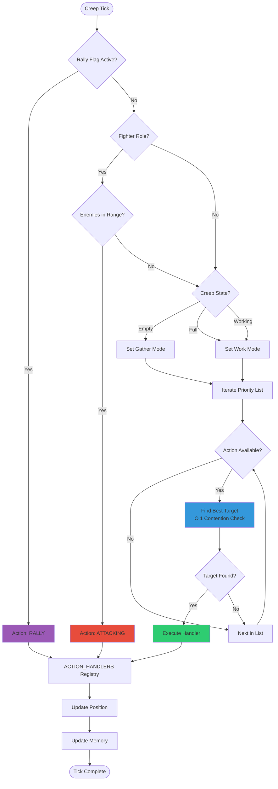

**Key Actions:**

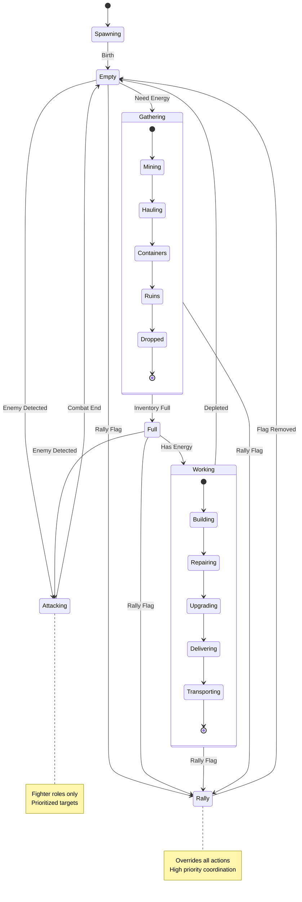

- `rally` — Move to rally flag and idle (flag-driven coordination)
- `gathering` — Collect energy from sources, containers, links, dropped resources, ruins, and **storage when >70% full** (overflow threshold, max 3 gatherers via contention check)
- `mining` — Stationary source harvesting (miners)
- `hauling` — Container/storage logistics, supports remote hauling via `isRemoteHauler` + `remoteFlagName` memory
- `transporting` — Energy distribution to spawn/extensions
- `delivering` — Targeted energy delivery to specific structures
- `building` — Construction site work
- `repairing` — Structure maintenance with priority scoring
- `upgrading` — Controller upgrading with link integration
- `attacking` — Combat with prioritized target selection
- `movingToAttack` — Long-range movement to attack flags

### Combat System

**Fighter Classes:**
- **Fodder:** Simple melee rush, disposable units
- **Invader:** Balanced melee with pickup/heal capability (1 CARRY part)
- **Healer:** Stay behind front line, heal damaged fighters (12 HP/tick per HEAL at range 1)
- **Shooter:** Maintain range 3, kite enemies (10-50 dmg per RANGED_ATTACK based on range)

**Defender Behavior:**
- **Combat mode:** Attack hostile creeps using baseCreep attack logic
- **Patrol mode:** Alternate between spawn and controller (CONFIG.COMBAT.PATROL_MODULO)
- **No economic tasks:** Defenders focus exclusively on combat

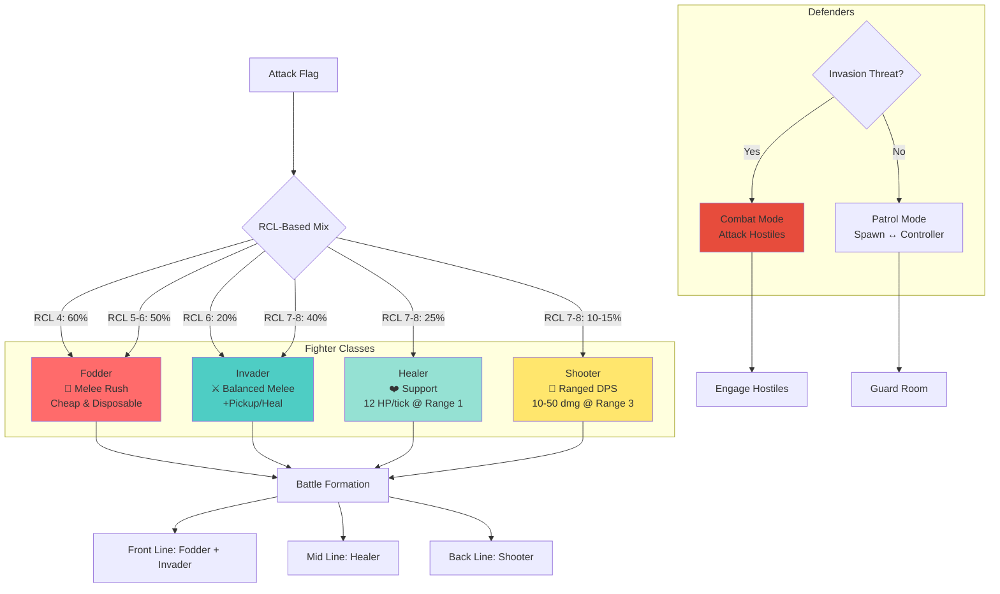

**RCL Progression Strategy**
- **RCL 1-3** — Swarm of small generalists ([WORK, CARRY, MOVE] × 2-4)
- **RCL 4-5** — Specialized roles emerge: stationary miners, pure haulers, dedicated upgraders
- **RCL 6-7** — Large specialists, mineral extraction, lab network active, fighter classes unlock
- **RCL 8** — Giant creeps with maximum efficiency, minimum count (50 parts max), roster scaling 0.4×

**Roster Scaling at High RCL:**
- RCL 6: 0.8× hauler/builder/upgrader count
- RCL 7: 0.6× hauler/builder/upgrader count
- RCL 8: 0.4× hauler/builder/upgrader/mineralExtractor/chemist count

```mermaid
gantt
    title RCL Progression & Role Evolution
    dateFormat X
    axisFormat RCL %L
    
    section Strategy
    Small Generalists (2-4 parts)    :rcl1, 1, 3
    Specialized Roles Emerge          :rcl2, 4, 2
    Large Specialists + Labs          :rcl3, 6, 2
    Giant Creeps (50 parts)           :rcl4, 8, 1
    
    section Roster Scaling
    Normal Count (1.0x)               :scale1, 1, 5
    Reduced Count (0.8x)              :scale2, 6, 1
    Further Reduced (0.6x)            :scale3, 7, 1
    Minimum Count (0.4x)              :scale4, 8, 1
    
    section Features
    Basic Economy                     :feat1, 1, 8
    Stationary Miners                 :feat2, 4, 5
    Links (RCL 5+)                    :feat3, 5, 4
    Labs + Minerals (RCL 6+)          :feat4, 6, 3
    Terminal + Trading (RCL 6+)       :feat5, 6, 3
    Fighter Classes (RCL 4+)          :feat6, 4, 5
```

---

## 3. Architecture & Module Map

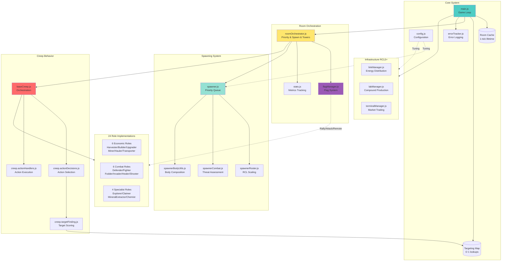

| Concern | File(s) | Key Info |
|---|---|---|
| **Core Loop** | [main.js](main.js) (636 lines) | Entry point, room cache, targeting map |
| **Configuration** | [config.js](config.js) (443 lines) | Centralized tuning, fighter config |
| **Error Tracking** | [errorTracker.js](errorTracker.js) (289 lines) | Rate-limited logging |
| **Flag Management** | [flagManager.js](flagManager.js) (419 lines) | Flag system with per-tick caching |
| **Room Orchestration** | [roomOrchestrator.js](roomOrchestrator.js) (706 lines) | Priority mode, spawning, creep routing |
| **Spawning System** | spawner.js (89) / spawnerBodyUtils.js (1010) / spawnerCombat.js (229) / spawnerCore.js (125) / spawnerHelpers.js (86) / spawnerRoster.js (120) | Full spawning pipeline |
| **Creep System** | baseCreep.js (213) / creep.actionHandlers.js (1176) / creep.actionDecisions.js (274) / creep.targetFinding.js (363) / creep.analysis.js (88) / creep.effects.js (100) / creep.constants.js (80) | Creep behavior pipeline |
| **Planning** | [planner.js](planner.js) (908 lines) | Layout generation, structure placement |
| **Statistics** | [stats.js](stats.js) (543 lines) | Telemetry tracking, efficiency metrics |
| **Infrastructure** | linkManager.js (183) / labManager.js (404) / terminalManager.js (293) | Energy/compound production/trading |
| **Utilities** | [utils.js](utils.js) (381 lines) | Pathfinding, terrain analysis |
| **Combat Roles** | role.defender.js (65) / role.fighter.js / role.fighterFodder.js (25) / role.fighterInvader.js (26) / role.fighterHealer.js (25) / role.fighterShooter.js (25) | Combat units |
| **Economic Roles** | role.harvester.js / role.upgrader.js / role.builder.js / role.miner.js / role.hauler.js / role.transporter.js | Energy roles |
| **Specialist Roles** | role.explorer.js (185) / role.claimer.js / role.mineralExtractor.js (263) / role.chemist.js (143) | Specialized functions |

---

## 4. Key Files Quick Reference

**Entry Points:** [main.js](main.js) • [config.js](config.js) • [errorTracker.js](errorTracker.js)

**Spawning:** [spawner.js](spawner.js) • [spawnerBodyUtils.js](spawnerBodyUtils.js) • [spawnerCombat.js](spawnerCombat.js)

**Creep Behavior:** [baseCreep.js](baseCreep.js) • [creep.actionHandlers.js](creep.actionHandlers.js) • [creep.actionDecisions.js](creep.actionDecisions.js)

**Room Management:** [roomOrchestrator.js](roomOrchestrator.js) • [planner.js](planner.js) • [stats.js](stats.js)

**Infrastructure:** [linkManager.js](linkManager.js) • [labManager.js](labManager.js) • [terminalManager.js](terminalManager.js)

**Flag System:** [flagManager.js](flagManager.js) • [flag-system-documentation.md](flag-system-documentation.md)

**Roles (24 total):** 6 economic + 6 combat + 4 specialist + explorer/claimer

---

# PART 2: CRITICALITIES & POTENTIAL ISSUES

## 5. Critical Issues (High Severity)

| # | Issue | Status |
|---|---|---|
| 1 | **Incomplete error handling in 20+ modules** — errorTracker + infrastructure managers covered, but role files, planner, utils, flagManager, spawnerCombat lack error boundaries. | PARTIALLY RESOLVED |
| 2 | **creep.actionHandlers.js is 1190 lines** — Still largest module. Long handlers: handleDelivering (~84 lines), handleGathering (~83 lines + ruins), handleHauling (~100+ lines). | UNRESOLVED |
| 3 | **spawnerBodyUtils.js grew to 1127 lines** — Now 19+ body functions. Controlled growth but lacks organizational structure. | STABLE |
| 4 | **planner.js has O(n^4) nested loop** — `findOptimalCenter` with 4-level deep (x, y, dx, dy) nesting. Should use distance transform. | UNRESOLVED |
| 5 | **Module path inconsistency** — Some use `require("baseCreep")`, others `require("./baseCreep")`. Affects 5+ old role files. | PARTIALLY IMPROVED |
| 6 | **Circular dependency risk** — flagManager required by 15+ modules (creep.*, spawner*, planner, 7 roles). Single point of failure. Verify with `madge --circular .` | NEEDS VERIFICATION |
| 7 | **flagManager.js is new critical module** — 419 lines, high coupling, no error handling. If it breaks, entire system fails. | NEW RISK |

---

## 6. Code Quality Issues (Medium Severity)

| # | Issue | Status |
|---|---|---|
| 8 | **planner.js has multiple concerns** — Layout generation, structure placement, pathfinding, visualization should be separate. | UNRESOLVED |
| 9 | **Long action handlers lack refactoring** — handleDelivering, handleGathering, handleHauling, handleAttacking, handleRally should be split. | WORSENED |
| 10 | **Triple nested loops** — In planner.js and utils.js. Consider functional approaches. | UNRESOLVED |
| 11 | **Significant let keyword usage** — 102+ instances pre-2026-03-29, +30-50 from new modules. Most in loops but also business logic. | WORSENED |
| 12 | **19+ similar body functions** — While pure, suggests need for parameterized builder pattern. | WORSENED |
| 13 | **No flag naming validation** — Conflicting flag names (attack vs attack_1) cause undefined behavior. | NEW ISSUE |
| 14 | **Threat assessment not self-contained** — spawnerCombat.js hasKilledCreeps relies on external memory updates. | NEW ISSUE |

---

## 7. Recommendations (Next Sprint Priorities)

### Priority 1: Critical Testing
1. **Test ruins feature thoroughly** — Validate `instanceof Ruin` detection, energy recovery rates, PvP scenarios
2. **Validate remote hauling ROI** — Test 2-4 room distances, verify positive ROI, test fallback to local mode
3. **Verify body cost fixes** — Confirm no oversized creep spawning, validate against max capacity
4. **Add error handling** — flagManager, spawnerCombat, 5 fighter roles, role.defender need try-catch
5. **Verify no circular deps** — Run `madge --circular .` to confirm module graph is acyclic

### Priority 2: Code Quality  
6. **Refactor creep.actionHandlers.js** — Extract long handlers into sub-functions
7. **Organize spawnerBodyUtils.js** — Group 19+ functions by category (workers/miners/haulers/fighters/specialists)
8. **Consider role.hauler.js split** — Separate local/remote modes if feature expands
9. **Standardize module paths** — Convert all requires to `require("./module")` format
10. **Maintain log discipline** — Continue removing debug statements (target: <120 total)

### Priority 3: Performance & Validation
11. **Profile ruins feature** — CPU impact of `instanceof Ruin` checks (target: <0.5 CPU/tick)
12. **Profile remote hauling** — Pathfinding overhead (target: <2 CPU/tick)
13. **Optimize planner.js** — Replace O(n^4) with distance transform
14. **Monitor Memory growth** — Track fragmentation from error tracking/boost queue/lab categories

### Priority 4: Documentation & Features
15. **Document ruins feature** — User guide for when/where ruins appear
16. **Document remote hauling** — Guide for flag placement, ROI expectations
17. **Add threat history tracking** — Make spawnerCombat self-contained
18. **Implement flag validation** — Detect conflicting flag names
19. **Expose fighter config** — Consider per-room ratio overrides

---

# PART 3: LATEST UPDATES & PROJECT HISTORY

## 8. Recent Updates (2026-03-30 12:00 → 2026-04-01 18:00)

### ✨ NEW FEATURE: Pickup from Ruins
**Status:** Complete ✅  
**Implementation:** 2026-03-31 (commit `d89cff5`)

**Purpose:** Automatically harvest energy from destroyed creep structures (ruins) to recover energy and prevent waste in contested areas.

**Integration:**
- Detection via `instanceof Ruin` check in `handleGathering()` [creep.actionHandlers.js](creep.actionHandlers.js#L80-L110)
- Treated as gathering source like containers and dropped resources
- Uses `creep.withdraw(ruin, RESOURCE_ENERGY)` with path-finding if out of range

**Benefits:** Recovers energy from destroyed creeps in PvP situations, reduces energy loss in raids, minimal performance impact

---

### 🚚 IMPROVED FEATURE: Remote Hauling (Simplified)
**Status:** Refactored ✅  

**Design:** Each `source_X` flag assigns exactly 1 remote hauler — no remote miners.
- **Per-flag assignment** via `remoteFlagName` and `remoteRoom` in hauler memory
- **Closest spawn selection** using `findClosestSpawn()` (picks spawn nearest exit toward target room)
- **Priority collection** in remote room: Tombstones → Ruins → Dropped Resources → Containers → Storage
- **Fallback** to local hauling when assigned flag is removed
- **Cross-room dedup** — global `Game.creeps` scan prevents duplicate haulers per flag

**Config:** `CONFIG.REMOTE_HARVESTING` — `ENABLED`, `AVOID_HOSTILE_ROOMS`, `FLAG_PATTERN`

**Flow:** Remote Room (Tombstone/Ruins/Container) → Remote Hauler → Home Room → Normal Delivery Priority

---

### 🔧 BUG FIXES: Body Composition & Spawner
**Status:** Complete ✅  
**Fixes:**
- `5e4c7c5` — Fixed body cost calculation error
- `317eefd` — Fixed overly expensive body sizing
- `2b5247f` — Fixed max energy capacity handling

**Result:** More predictable spawning, reduced wasted energy, faster RCL progression

---

### ⚙️ CONFIG CHANGE: Priority Mode Tuning
**Status:** Complete ✅  
**Change:** Disabled harvester boost (HARVESTER_BOOST: 0)

**Impact:** Simpler roster management, less volatile creep counts, better stability

---

### 🧹 CODE CLEANUP: Log Statement Removal
**Status:** Complete ✅  
**Changes:** Removed 40+ debug console.log statements across codebase

**Benefits:** Reduced console noise, potential CPU savings, cleaner logs

---

### 📊 Summary Statistics (Latest 16 Commits)
- **Files changed:** 27 modified, 0 new modules
- **Net changes:** ~1,933 insertions, ~469 deletions
- **Major themes:** Resource recovery (ruins), remote operations, body validation, cleanup

---

## 9. Major Features Since 2026-03-26

### 🚀 CPU Optimization System (60-85% savings)
**Phase 1:** Global Room Cache (eliminates 200+ redundant find() calls) — *-30 to -40 CPU/tick*

**Phase 2:** Infrastructure Manager Caching (links, labs, terminal) — *-3 to -4 CPU/tick*

**Phase 3:** RCL-Based Roster Scaling (0.4× to 0.8× at high RCL) — *-10 to -20 CPU/tick*

### 🚩 Centralized Flag Management System
**Module:** [flagManager.js](flagManager.js) (419 lines)

**Supported Flags:** Rally, Attack, Remote Source, Claim, Explore, Deconstruct, Priority Build, Planner

**Benefits:** Single source of truth, per-tick caching, clean API, 7+ role integration

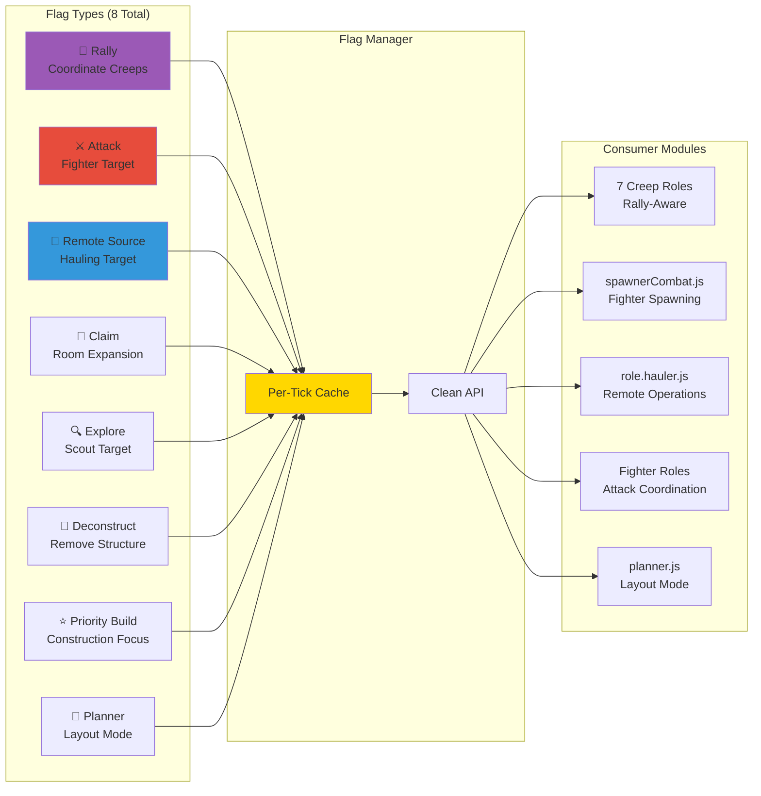

### ⚔️ Specialized Fighter Class System
**4 Classes:** Fodder (cheap), Invader (balanced), Healer (support), Shooter (ranged)

**Ratios (RCL-based):** 60% fodder at RCL 4 → 40% invader + 25% healer at RCL 8

**Scaling:** Cost-effective mix from RCL 4-8 with evolving composition

### 🛡️ Emergency Defender System
**Threat Detection:** invaderCount ≥ 2 OR totalAttackPower ≥ 200 OR hasKilledCreeps

**Body:** Max 4 ATTACK, TOUGH armor, optimized MOVE ratio

**Behavior:** Combat mode or patrol mode, no economic tasks

### 🔄 Rally Flag System
**Purpose:** Coordinate creep gathering for mass movements, defensive positioning

**Integration:** 7 rally-aware roles (harvester, upgrader, builder, miner, hauler, transporter, fighter)

**Behavior:** Place flag → creeps rally → remove flag to resume normal tasks

---

## 10. Historical Context & Git Timeline

### Performance Optimization Phase (6 commits)
- `f5f4653` CPU optimization phase 3 (roster scaling)
- `66d8cca` CPU optimization phase 2 (manager caching)
- `10a9bd6` CPU optimization phase 1 (room cache)
- `b54197d` Removed remote gathering (experimental rollback)
- `a074415` Move to remote source
- `adccd5e` Remote sources implementation

### Combat System Overhaul (9 commits)
- `d0a6a37` Created 4 fighter role files
- `d62ba18` Added role.defender.js + spawnerCombat.js
- `78cc2f3`, `92691e6`, `e789293` Fighter movement updates
- `1fe2d35` Attack logic for adjacent rooms
- Various syntax/logic fixes

### Flag System Development (7 commits)
- `59ac52f` Created flagManager.js, flag docs, file reorganization
- `29b36ff` Added rally action to 7 roles
- `1765375` Fixed rally idle behavior
- `c127363`, `40c518d`, `54d9fab` Attack flag fixes and integration
- `2e9616c` Fixed flagManager syntax

---

## 11. Codebase Metrics (as of 2026-04-01 18:00)

**Total Size:** ~12,000 lines across 40 JS files

**Largest Files:**
- creep.actionHandlers.js: 1190 lines (+14 since 2026-03-30)
- spawnerBodyUtils.js: 1127 lines (stabilized)
- planner.js: 908 lines
- stats.js: 543 lines

**Growth Rate:** Slowing significantly (+864 lines in 1 week vs +1,300 in previous 4 days)

**Error Coverage:** Partial (errorTracker + 3 infrastructure managers covered; 20+ modules still need error handling)

**New Modules:** 0 in latest iteration (all from 2026-03-25 to 2026-03-30)

---

## 12. Performance Achieved

- **Room Cache:** 200+ redundant find() calls → 5-8 calls/tick ✅
- **Targeting Map:** O(n×m) complexity → O(n) ✅
- **Creep Count (RCL 8):** 20-30 creeps → 10-15 creeps (roster scaling 0.4×) ✅
- **Estimated Total Savings:** 60-85% CPU reduction ✅

---

## 13. Feature Status Summary

| Feature | Status | Impl Date | Notes |
|---|---|---|---|
| Ruins Pickup | Complete | 2026-03-31 | `instanceof Ruin` detection working |
| Remote Hauling | Enhanced | 2026-03-31 | Multi-room coordination stable |
| Body Fixes | Complete | 2026-04-01 | Cost calculation, size validation |
| Priority Mode | Tuned | 2026-03-31 | HARVESTER_BOOST disabled |
| Flag System | Complete | 2026-03-29 | flagManager.js stable |
| Fighter Classes | Complete | 2026-03-29 | 4 classes with config ratios |
| Defenders | Complete | 2026-03-29 | Threat detection active |
| Rally System | Complete | 2026-03-29 | 7 roles integrated |
| CPU Optimization | Phase 3 | 2026-03-29 | Estimated -60 to -85 CPU |

---

## 14. Key Metrics to Track

**Ruins Recovery Rate:** Track energy recovered vs baseline (target: +5-10% efficiency)

**Remote Hauling ROI:** Energy flow from remote rooms (target: positive ROI at 2+ distance)

**CPU Usage:** Validate no regression (target: <1% overhead from new features)

**Creep Count (RCL 8):** Target 10-15 creeps (from 20-30)

**Error Rate:** Monitor via `global.errorSummary()` (target: <5 errors/100 ticks)

**Fighter Win Rate:** Track combat success with class system

**Code Coverage:** Track error handling additions (20+ modules need coverage)

---

## Appendix: Quick Navigation

**Documentation Files:**
- [cpu-optimization.md](cpu-optimization.md) — Detailed optimization phases
- [flag-system-documentation.md](flag-system-documentation.md) — Flag system guide
- [screeps.md](screeps.md) — Screeps context
- [prompt-template.md](prompt-template.md) — Prompt boilerplate

**All Files:** See Part 1, Section 3 for complete Architecture table

---

**End of Reorganized Project Spec**

# Part 4: FUTURE IMPROVEMENTS AND IDEAS

## 1. Efficient Hauling from other rooms

## 2. Slow down defendender spawning reaction time
Usually the defender get spawned after the invader is already dead

## 3. Improve upgrading when other major tasks are completed

## 4. Limit the number of creeps on higher RCL

To avoid having a lot of small creeps